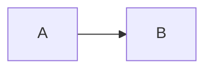

# Authoring Drive Docs

Markdown files under `earlbear-content/gdocs/` are the **editable source of truth**. The Google Doc is a rendered view produced by `ebdocs sync push`. The markdown → Docs converter is mostly faithful, but a handful of markdown patterns trigger rendering glitches. This skill is the checklist to avoid them.

## When to trigger

- Authoring or editing any `.md` file under `earlbear-content/gdocs/`
- Adding mermaid diagrams, code blocks, tables, or nested lists to a doc that will be pushed
- Debugging a Drive doc that "looks wrong" after `sync push`
- Preparing a new reference doc for first-time push

## The rules

### 0. Write for a business audience, not an engineer

Drive docs are read by leadership, reviewers, and eventually stakeholders who do not live in the codebase. Default to plain English and business outcomes. Specifically:

- **Avoid jargon**: orchestrator, executor, pipeline, router, downstream, dispatcher, agent memory, task queue, cron tick, CLI, tool name dropping (ebjira, ebdocs, ebshop, mmdc, Pygments).
- **Prefer natural verbs**: routes, hands off, checks, fixes, reviews, approves, schedules.
- **Describe outcomes, not plumbing**: "catches broken checkouts before sales drop" beats "runs cron-triggered scans against the health-metric pipeline".
- **Introduce any technical term in plain language first**, then use it. "When a scheduled check fires off each morning..." beats "On the 6:00 AM cron tick...".
- **Agent descriptions read as flowing prose**, not bulleted field lists. Aim for one or two paragraphs per agent that a non-engineer can follow end-to-end.
- **No em-dashes or en-dashes in body prose.** Em-dashes (—) as parenthetical asides are a classic AI-writing tell. Use commas, parentheses, or split sentences instead. Exception: heading text (e.g. "Watson — Orchestrator") and mermaid diagram labels are fine since they are structural, not voice. The `doc validate` check `em_dash_in_body` enforces this on every push.
- **Exception**: tables and code blocks stay concise — a wave-plan table with "Internal" or "event-driven" is fine because the layman context is set by the surrounding paragraphs.

If a reviewer would say "this reads like documentation for a system I cannot see," rewrite it.

### 1. Blank line before every `##` and `###`

markdown-it absorbs a heading into the preceding bullet list when there is no blank line between them. The heading then renders as a list item in the Doc instead of a heading.

Wrong:
```markdown
- Last bullet in the list
### Next section
Body text.
```

Right:
```markdown
- Last bullet in the list

### Next section

Body text.
```

Always leave a blank line **before and after** every heading. This is the single most common rendering glitch.

### 2. EARL-NNN auto-linkifies — don't write the URL

Any `EARL-<num>` reference in body text is automatically converted to a hyperlink to `https://earlbear.atlassian.net/browse/EARL-<num>` by the converter.

- ✅ `See EARL-149 for context.`
- ✅ `See [EARL-149] for context.`
- ❌ `See [EARL-149](https://earlbear.atlassian.net/browse/EARL-149) for context.` — redundant, the converter does this for you.

### 3. Bullet nesting: stick to 2 levels, 2-space indent

Nested bullets render correctly via tab-based nesting in the converter. Use a 2-space indent for sub-bullets. Three or more levels haven't been tested — avoid them.

```markdown
- Top level
  - Nested once (fine)
    - Nested twice (untested, may break)
```

### 4. Don't put adjacent ordered and bulleted lists

Google Docs merges adjacent list paragraphs into one logical list regardless of the markdown preset. If you write a bulleted list followed immediately by a numbered list, they collapse into one (with whichever style wins).

Put a paragraph or heading between them:

```markdown
- Bullet one
- Bullet two

Here is some explanatory prose.

1. First numbered
2. Second numbered
```

### 5. Mermaid diagrams: layered rendering with graceful degradation

Write fenced mermaid blocks normally:

````markdown

````

There are three render layers, tried in order, handling both local dev and the cloud context where no host docker is available:

1. **Host-side `mmdc` (fast path, local dev).** If you have `@mermaid-js/mermaid-cli` installed, `bin/ebdocs` runs `docs/scripts/render_mermaid.py` automatically before every `sync push` or `sync create` and renders missing PNGs. You can also run the script manually for offline preview: `python docs/scripts/render_mermaid.py gdocs/<section>/<file>.md`.

2. **Sidecar image (local dev without Node).** If host mmdc isn't available, the same `render_mermaid.py` falls back to `docker run --rm ebdocs-mermaid ...` using a pre-built sidecar image. The sidecar lives ~2 seconds per render and exits. Build it once with `make ebdocs-mermaid-build`. Nothing lingers; `--rm` guarantees cleanup.

3. **Code-block degradation (cloud context).** When neither render path is available — claude-agent-cloud runs ebdocs with no host docker, no mmdc, and no bin/ebdocs wrapper — the main ebdocs container catches the cache miss and embeds the mermaid source as a syntax-highlighted code block in the Drive doc. The reader sees the diagram source as colored code, not as a visual image, but nothing is lost. The strict validator treats this as an info-severity `degraded_mermaid_rendering` advisory, not a failure, so `sync push --strict` still passes in cloud.

**Canonical form:** the `.md` file is never modified. The ```mermaid block stays as source so VS Code, GitHub, and any other viewer render it natively. The `.assets/mermaid-<hash>.png` cache is the only place PNGs live.

**To get visual diagrams in a cloud-rendered doc:** render them on a dev machine first (either path 1 or 2 works), commit the PNGs in `.assets/` to the content repo, then push from cloud. The cloud container reads the cached PNG from disk and uploads it.

**Verifying rendering before push.** Run `./bin/ebdocs doc lint /content/gdocs/<section>/<file>.md` to check whether your mermaid blocks will render as inline images or degrade to code blocks — the linter runs the same `collect_doc_issues` validator the post-push check runs, but against a synthetic doc built from the parsed markdown. No Drive mutation, no need to push to a scratch doc to find out your diagrams break.

### 6. Code blocks render as single-cell tables

Google Docs has no native code block. The converter inserts a 1×1 table with monospace font, cell shading, and per-token Pygments syntax highlighting.

- Supported languages: anything Pygments knows + a custom Mermaid lexer
- Unknown languages render as plain monospace (still with cell shading)
- Always tag your fence with a language hint when known: ```` ```python ````, ```` ```bash ````, ```` ```yaml ````

### 7. Tables work — keep them simple

Plain markdown pipe tables render via a 2-pass insert. Constraints:

- Text-only cells
- No tables inside tables
- No inline code blocks inside cells
- **No inline formatting inside cells.** Bold, italic, and markdown links inside a table cell do NOT render — table cell text bypasses markdown-it's inline segment processing entirely. Write `EARL-149` as plain text, not `[EARL-149](https://...)`.
- **Cell auto-linking works for EARL-NNN** even though inline formatting is skipped — a post-insert scan adds the Jira link after the cell text is in place.
- **Cell-to-heading auto-linking:** if a cell's trimmed text *exactly matches* an `##`/`###` heading elsewhere in the doc, the cell becomes a clickable link to that heading anchor. So a summary table with agent names in the "Agent" column automatically links to the "### Agent name" detail section below. Keep cell text and heading text byte-identical to trigger this.

```markdown
| Agent | Layer | Issue |
|-------|-------|-------|
| Watson — Orchestrator | Internal | EARL-149 |
```

The "Watson — Orchestrator" cell links to `### Watson — Orchestrator` (if that heading exists in the same doc). The "EARL-149" cell links to Jira.

### 7a. Table styling is tight by default

API-inserted tables automatically get:

- 9pt font (not the default 11pt)
- 3pt vertical / 4pt horizontal cell padding (not the default ~5pt)
- Content-aware column widths computed from each column's longest text chunk

You don't set any of this yourself — the converter handles it. But knowing it explains why the doc looks tighter than a Docs-UI-created table.

### 8. Don't nest blockquotes inside lists

Untested combination, may break the list rendering. If you need a callout inside a list, use bold text or a sub-bullet instead.

### 9. Frontmatter is local-only

YAML between `---` blocks at the top of the `.md` file is stripped before push. Use it for:

```yaml
---
tags: [playbook, ecommerce]
specifies: [EARL-185]
agent_hints: |
  Two-sentence summary for agents that grep this file.
---
```

Frontmatter never appears in the Drive doc.

### 10. Preview before pushing

Use the local preview to see syntax highlighting and structure without a Docker round-trip:

```bash
./bin/ebdocs sync preview gdocs/<section>/<file>.md
```

Terminal-colored output approximates how Pygments will tokenize each code block.

### 11. Pre-push sanity checks

```bash
# Would this markdown render cleanly if pushed? (local-only, no Drive roundtrip)
./bin/ebdocs doc lint /content/gdocs/<section>/<file>.md

# What would change in the Drive doc?
./bin/ebdocs sync diff --file /content/gdocs/<section>/<file>.md

# Are all mermaid blocks rendered?
python docs/scripts/render_mermaid.py gdocs/<section>/<file>.md --dry-run
```

`ebdocs doc lint` parses the markdown with the same converter `sync push` uses, builds a synthetic Google Doc structure from the parsed requests, and runs the full `collect_doc_issues` validator against it — no Drive id required, no API call made. It catches everything the post-push validator catches: `heading_with_bullet`, `em_dash_in_body` (with the quoted/italic exemptions), `earl_key_not_linked`, `code_blocks_rendered_as_tables`, `transitive_list_merge`, `nesting_level_drift`, `task_list_checkbox_rendered`, and the info-severity `degraded_mermaid_rendering` advisory. Exit 0 on clean, 1 on any error-severity issue; info-only issues go to stderr as advisories with exit 0. Use it from pre-commit hooks and during authoring. The `--dry-run` flag on `render_mermaid.py` reports which mermaid blocks have cached PNGs and which don't, without rendering anything.

## The push workflow

1. **Create the markdown file** under `earlbear-content/gdocs/<section>/...`. Add frontmatter with `tags`, `specifies`, and `agent_hints`.
2. **Render mermaid diagrams:**
   ```bash
   python docs/scripts/render_mermaid.py gdocs/<section>/<file>.md
   ```
3. **Create the yaml stub** that ties this file to a Drive doc:
   ```bash
   ./bin/ebdocs sync create /content/gdocs/<section>/<file>.md \
     --folder <folder> \
     --jira EARL-<num>
   ```
4. **Push to Drive (validated by default):**
   ```bash
   ./bin/ebdocs sync push --file /content/gdocs/<section>/<file>.md
   ```
   `sync push` automatically runs `ebdocs doc validate` against each pushed doc and exits non-zero if any check fails, so automation can gate on it. Checks include: headings don't have bullets, list presets match source, EARL-NNN mentions are hyperlinks, mermaid blocks render as inline images, code blocks render as tables, no transitive list merges across headings. To skip validation for a scratch doc, pass `--no-strict`.
5. **Post a Jira comment** linking to the Drive doc URL on the related issue. Never link back to the local `gdocs/...` path — Jira-side references are always Drive URLs.

## Quick checklist before every push

- [ ] Run `./bin/ebdocs doc lint /content/gdocs/<section>/<file>.md` to catch rendering issues before pushing
- [ ] Reads as plain English, not system-internals jargon (see rule 0)
- [ ] No em-dashes or en-dashes in body prose (headings and mermaid labels exempt)
- [ ] Blank line before every `##` and `###`
- [ ] No manual hyperlinks for `EARL-NNN` references
- [ ] Bullet nesting stays at 2 levels max
- [ ] No adjacent ordered + bulleted lists
- [ ] All mermaid blocks rendered (`render_mermaid.py --dry-run` clean)
- [ ] Code fences have language hints
- [ ] Tables are text-only, no nesting, no inline formatting inside cells
- [ ] Summary table "Agent"-style columns use text that exactly matches detail-section heading text (enables cross-link)
- [ ] Frontmatter has `tags`, `specifies`, `agent_hints`
- [ ] `sync preview` looks right
- [ ] `sync diff` shows the expected changes

## The branded theme

Every pushed doc gets a consistent look applied as a post-push theming pass. The theme is defined in `theme.yaml` next to this skill (`.claude/skills/authoring-drive-docs/theme.yaml`) and covers:

- **Body font, size, line spacing, paragraph spacing** — Inter 11pt, 1.15 line height, 8pt space-below each paragraph (so consecutive paragraphs have a visible gap).
- **Heading font, per-level sizes, color, space-above/below** — Source Serif Pro bold, sizes 22/18/14pt for H1/H2/H3, muted dark blue-gray, 14pt above and 6pt below.
- **Table cell styling** — 9pt font, 3pt/4pt padding, content-aware column widths.
- **Code block styling** — Courier New monospace, light gray-blue cell background.

Read `theme.yaml` to see the exact current values. Edit it to change the look — the sync engine reloads it on every push, so no code change is needed for a font swap or color tweak.

**Per-doc overrides:** a doc can override any key via its frontmatter `theme:` block (see the comment at the top of `theme.yaml` for the schema).

## Known issues (as of 2026-04-07)

These rules exist because the markdown → Docs converter has known sharp edges. For the technical details on **why** each rule is needed (markdown-it tokenization quirks, Docs API limitations, the two-pass table insertion model, the mermaid render cache, etc.), see `docs/gdocs-sync-gotchas.md`.

When in doubt, push to a scratch doc first and inspect the result in Drive before overwriting a canonical reference doc.
